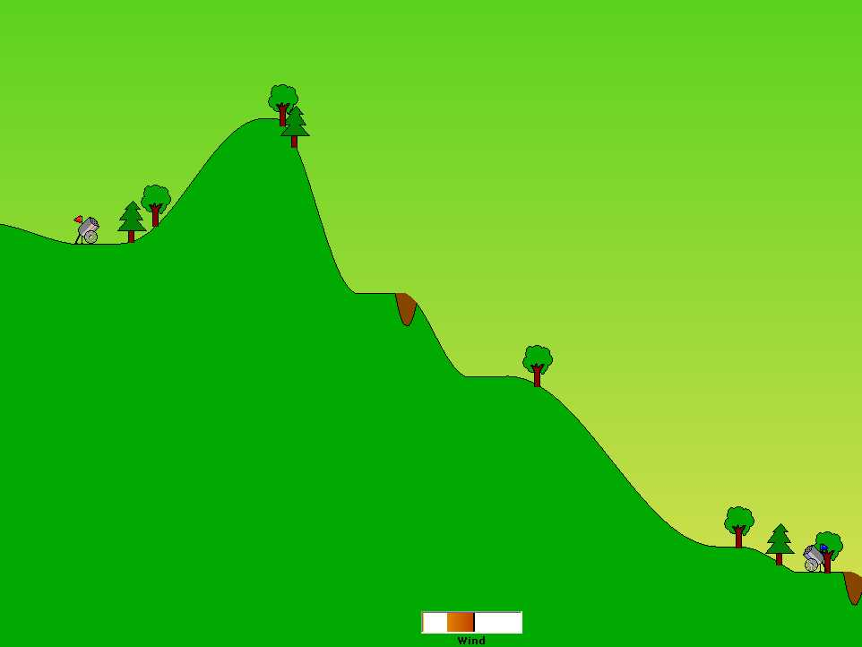



## Bang Bang Clone\!

### Description

"This is a remake of an old 2-player game, where you was a cannon and you had to shoot at the other cannon. They are placed randomly in a random-generated landscape. The game simulates wind and gravity, so it's not so easy to destroy the adversary cannon. Tell me if you liked this, or suggestions, and VOTE!!"
 
### More Info
 

             |
---                |---
**Submitted On**   |2002-04-08 15:36:00
**By**             |[Enrico Bertozzi](https://github.com/Planet-Source-Code/PSCIndex/blob/master/ByAuthor/enrico-bertozzi.md)
**Level**          |Intermediate
**User Rating**    |4.5 (18 globes from 4 users)
**Compatibility**  |VB 5\.0, VB 6\.0
**Category**       |[Games](https://github.com/Planet-Source-Code/PSCIndex/blob/master/ByCategory/games__1-38.md)
**World**          |[Visual Basic](https://github.com/Planet-Source-Code/PSCIndex/blob/master/ByWorld/visual-basic.md)
**Archive File**   |[Bang\_Bang\_70561492002\.zip](https://github.com/Planet-Source-Code/enrico-bertozzi-bang-bang-clone__1-33649/archive/master.zip)

